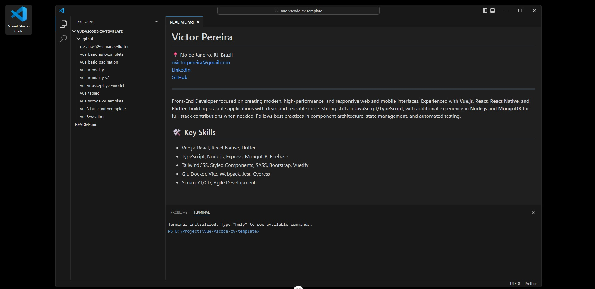

# VS Code CV Template

A Vue.js template that simulates the Visual Studio Code interface to showcase your resume/cv and GitHub portfolio in a unique and developer-friendly way.



## Features

- **VS Code Interface**: Authentic VS Code look and feel with dark theme
- **GitHub Integration**: Display your repositories directly from GitHub
- **CV Display**: Present your CV in a markdown-styled format
- **Responsive Design**: Works on desktop and mobile devices
- **Customizable**: Easy to modify for your personal information
- **Terminal Simulation**: Functional terminal bar with command history
- **Interactive UI Elements**:
  - Working drag bars for sidebar and terminal resizing
  - Functional window control buttons (minimize, maximize, close)
  - Tab navigation for documents

## System Requirements

- Node.js 18.x or higher
- npm 9.x or higher

## Getting Started

### Configuration

1. **Set your GitHub username** - Edit `src/constants/index.ts`:

```typescript
export const PROJECT_NAME = 'vue-vscode-cv-template'
export const GITHUB_USERNAME = 'your-github-username' // Change this to your GitHub username
export const TERMINAL_PATH = `D:\\Projects\\${PROJECT_NAME}`
```

2. **Edit your resume** - Modify `src/markdown/RESUME.md` with your personal information:

```markdown
# Your Name

## About Me

A brief description about yourself...

## Experience

- Job title at Company (YYYY-YYYY)
  Description of responsibilities and achievements

...
```

## License

[MIT](LICENSE)

## Acknowledgements

- Built with [Vue.js](https://vuejs.org/)
- Inspired by [Visual Studio Code](https://code.visualstudio.com/)
